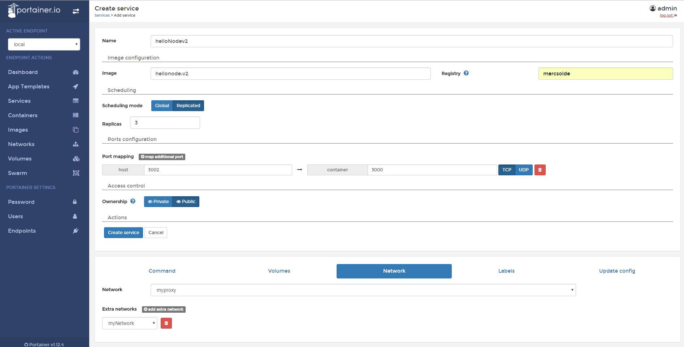

# Setup

Para acceder al portainer, nos dirigimos a la siguiente url.

	http://192.168.99.100:9000/

Seteamos una contraseña para el usuari admin y seleccionamos la opción 
  
  `Manage the Docker instance where Portainer is running`

Finalmente pulsamos en `connect` y ya tendremos disponible la consola web parar llevar a cabo el _managing_ del os contenedores.

Podremos acceder a la imágen de node(blue) via:
	
	http://192.168.99.100:3000/hello

# Crear un servicio

1. Nos dirigimos a la pestanya _Services_ y pulsamos el botón _Add Service_
2. Rellenamos el documento del siguiente modo para hacer un _deploy_ y pulsamos el botón _Create Service_
